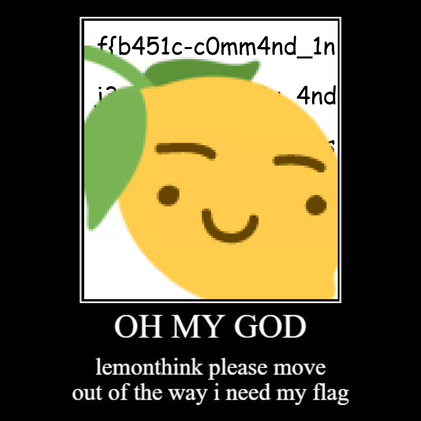
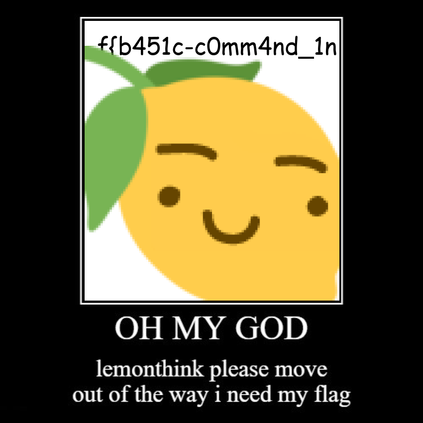

# Lemonthinker

- Category: Web
- Points: 100
- Author: willwam845

```asciiarmor
generate your lemonthinks here!

:lemonthink:

Note: All characters that look like a O are actually a 0, please  try replacing all O's with  0's if you find that your flag does not work.
```


## Exploring

We have been given the challenge source files and our own instance:


Cool, before we check out the source, it is time to just see what happens if we input `lemonthink`:


Alright, so our input is entered into an image. Time to check out the source file in `app/app.py`:

```python
from flask import Flask, request, redirect, url_for
import os
import random
import string
import time # lemonthink

clean = time.time()
app = Flask(__name__)
chars = list(string.ascii_letters + string.digits)

@app.route('/')
def main():
    return open("index.html").read()

@app.route('/generate', methods=['POST'])
def upload():
    global clean
    if time.time() - clean > 60:
      os.system("rm static/images/*")
      clean = time.time()
    text = request.form.getlist('text')[0]
    text = text.replace("\"", "")
    filename = "".join(random.choices(chars,k=8)) + ".png"
    os.system(f"python3 generate.py {filename} \"{text}\"")
    return redirect(url_for('static', filename='images/' + filename), code=301)
  
if __name__ == "__main__":
  app.run("0.0.0.0",1002)

```

Brilliant, we have a flask application that has two endpoints. The basic home page at `/` and a generating method at `/generate`. The `upload` function in `generate` is what we are looking for:

```python
@app.route('/generate', methods=['POST'])
def upload():
    global clean
    if time.time() - clean > 60:
      os.system("rm static/images/*")
      clean = time.time()
    text = request.form.getlist('text')[0]
    text = text.replace("\"", "")
    filename = "".join(random.choices(chars,k=8)) + ".png"
    os.system(f"python3 generate.py {filename} \"{text}\"")
    return redirect(url_for('static', filename='images/' + filename), code=301)

```

 For those of you, who are not familiar with flask, the line `@app.route('/generate',methods=['POST'])` specifies that the function below (`upload()`) is to be used at `<instance>/generate` accepting only the POST method. 

*Note: If you do not know what a POST method is, read [here](https://developer.mozilla.org/en-US/docs/Web/HTTP/Methods/POST) and more about http methods [here](https://developer.mozilla.org/en-US/docs/Web/HTTP/Methods)*

Now we have to check what our input is, as there seam to be variables of note: `text` and `filename`:

```python
    text = request.form.getlist('text')[0]
    text = text.replace("\"", "")
    filename = "".join(random.choices(chars,k=8)) + ".png"
```

The variable `text` is retrieved from the input form on the webpage, additionally all double quotation marks `"` are replace by `\"`. While the `filename` is randomly set and not at all dependent on our input:

```python
    os.system(f"python3 generate.py {filename} \"{text}\"")
    return redirect(url_for('static', filename='images/' + filename), code=301)
```

Here we can see, that our input is passed to the `system` function from the `os` package, which allows us to access the operating system functions and shell ([more here](https://docs.python.org/3/library/os.html#os.system)). Our input and the filename are passed as arguments to the `generate.py` script, time to have a gander.

This will be a shortened version of the script:

```python
outfile = sys.argv[1]
text = sys.argv[2]

if len(text) > 1000: # Too much text :lemonthink:
  text = "Too long!"
```

We can see that our input must be below 1000 characters. Our input is then split into chunks, so that the length of the string to be entered into the image can be evaluated. In short:

```python
if "rarctf" in text: # Don't try and exfiltrate flags from here :lemonthink:
  img = Image.open("static/generator/noleek.png") 
  img.save(f"static/images/{outfile}")
else:
  img2 = Image.open('static/generator/lemonthink.png')
  img.paste(img2, (0, 0), img2.convert('RGBA'))
  if len(chunks) > 1:
    img3 = Image.open("static/generator/move.png").convert('RGBA')
    img3.paste(img, (170,42), img.convert('RGBA'))
    img3.save(f"static/images/{outfile}")
  else:
    img.save(f"static/images/{outfile}")
```

 If the string `rarctf` occurs anytime in the string, we get a special image:


Otherwise, the `lemonthink` image is used and further checks happen. If our input is deemed too long (ie. more than one chunk) a special `move.png` is generated:


In the case that `rarctf` is not in the input string and the input is not too long a normal image is generated. Good... now onto exploitation. Have you heard of command injection?


## Exploitation

We know that our input will be interpreted by a shell, if we consider that it is a bash-like shell, we could use special characters:

```
` -> the contents inbetween backticks is executed and the text is replaced by the output 
| -> a pipe, essentially chaining commands
; -> ends the previous command
etc.
```

Good, after some testing the backtick proves quite useful. After checking the provided `Dockerfile`:

```dockerfile
COPY flag.txt /flag.txt
```

We know the location of the flag file. However a simple `cat /flag.txt` does not do the job, remember the words `rarctf` cannot be present in the string. Maybe we can `cut` the output? 

```bash
cat /flag.txt|cut -c6-
```

This command will output the contents of the `/flag.txt` file and `cut` the first six characters:





Damn, too long! Well we could do two things now. We can read the flag "cut by cut", going 20 characters at a time will generate the `move out of the way` image, but the flag will be readable:





`f{b451c-c0mm4nd_1n` - Good, we can continue from here and eventually get the whole flag: 

```
rarctf{b451c-c0mmm4nd_1nj33ct1ion_f0r-y0u_4nd0our-l3m0nthink3rs_d8d21128bf}
```

The other method would be to just redirect the output to a file in `static/images/` or somewhere else. 


*Note: Some of you may have experienced seeing the flag immediately on viewing the page, that is likely because someone overwrote the index.html file in your instance.*