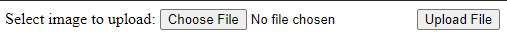
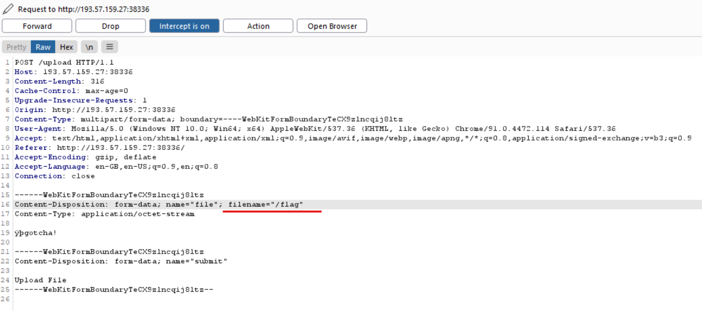
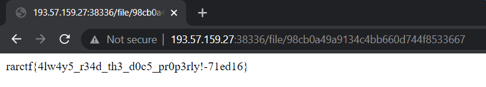

# Secure Uploader

- Category: Web
- Points: 150
- Author: clubby789

```asciiarmor
A new secure, safe and smooth uploader!
```


## Exploring

We have been given the source code and Dockerfile again, meaning that we could test the challenge locally again:

```
secureuploader
│   Dockerfile
│
└───app
    │   app.py
    │   database.db
    │   start.sh
    │
    └───uploads
            .gitkeep
```

Fantastic, let us first check the Dockerfile:

```dockerfile
FROM python:3-alpine
RUN  pip install --no-cache-dir flask gunicorn

RUN addgroup -S ctf && adduser -S ctf -G ctf

COPY app /app
COPY flag.txt /flag
WORKDIR /app

RUN chown -R ctf:ctf /app && chmod -R 770 /app
RUN chown -R root:ctf /app && \
  chmod -R 770 /app

USER ctf
ENTRYPOINT ["/app/start.sh"]

```

Most importantly, we know where the `flag` file is located again! The `start.sh` script seems to be called:

```bash
#!/bin/sh
gunicorn --chdir /app app:app -w 4 --threads 4 -b 0.0.0.0:1337
```

Brilliant, gunicorn is used to host servers, this will yet again help with local testing. Time to check out the actual app:

```python
from flask import Flask, request, redirect, g
import sqlite3
import os
import uuid

app = Flask(__name__)

SCHEMA = """CREATE TABLE files (
id text primary key,
path text
);
"""


def db():
    g_db = getattr(g, '_database', None)
    if g_db is None:
        g_db = g._database = sqlite3.connect("database.db")
    return g_db


@app.before_first_request
def setup():
    os.remove("database.db")
    cur = db().cursor()
    cur.executescript(SCHEMA)
```

Going part-by-part, we can see that an SQLite database structure is provided in the variable `SCHEMA`, where the table's name is `files` and it has two columns `id` (which is also the primary key) and `path`. The function `db()` returns an object for database interaction, and the `@app.before_first_request` is self-explanatory. On start, remove the database and create it again (essentially starting fresh). 

Moving on!

```python
@app.route('/')
def hello_world():
    return """<!DOCTYPE html>
<html>
<body>
<form action="/upload" method="post" enctype="multipart/form-data">
    Select image to upload:
    <input type="file" name="file">
    <input type="submit" value="Upload File" name="submit">
</form>

</body>
</html>"""


@app.route('/upload', methods=['POST'])
def upload():
    if 'file' not in request.files:
        return redirect('/')
    file = request.files['file']
    if "." in file.filename:
        return "Bad filename!", 403
    conn = db()
    cur = conn.cursor()
    uid = uuid.uuid4().hex
    try:
        cur.execute("insert into files (id, path) values (?, ?)", (uid, file.filename,))
    except sqlite3.IntegrityError:
        return "Duplicate file"
    conn.commit()
    file.save('uploads/' + file.filename)
    return redirect('/file/' + uid)
```

In the basic `/` route we only have a simple upload form, nothing fancy. The `/upload` route uses the `upload()` function, where we can see that no dots are allowed in the filenames, preventing us from the performing any `directory traversal` attacks. After the "dot check" is performed an `insert` query is performed, and our file is entered into the database, through what looks like a safe parameter substitution. The files are saved in the `uploads/` directory and then we are redirected to our file in `/file/+uid`. 

But what is actually exploitable? 

```python
@app.route('/file/<id>')
def file(id):
    conn = db()
    cur = conn.cursor()
    cur.execute("select path from files where id=?", (id,))
    res = cur.fetchone()
    if res is None:
        return "File not found", 404
    with open(os.path.join("uploads/", res[0]), "r") as f:
        return f.read()

if __name__ == '__main__':
  app.run(host='0.0.0.0')

```

 After navigating to a `/file/<id>` part of the app, the `file()` function is executed, where most notably we can see the `os` package being used! 

```python
os.path.join("uploads/",res[0],"r")
```

Our input (being the filename) goes in as `res[0]`, but what does `os.path.join` actually do? Best to consult the [docs](https://docs.python.org/3/library/os.path.html#os.path.join):

```asciiarmor
Join one or more path components intelligently. The return value is the concatenation of path and any members of *paths with exactly one directory separator following each non-empty part except the last, meaning that the result will only end in a separator if the last part is empty. If a component is an absolute path, all previous components are thrown away and joining continues from the absolute path component.
```

Time to move on to exploitation.


## Exploit

Remember the `Dockerfile`?

```dockerfile
COPY flag.txt /flag
```

The flag file is copied to the root directory of the system `/` and renamed to not have any dots in the name ie. `/flag`. And if we remember a really important part of the documentation:

```asciiarmor
If a component is an absolute path, all previous components are thrown away and joining continues from the absolute path component.
```

The absolute path to `/flag` is `/flag`. Time to test the exploit:





Time to upload and manipulate the filename in Burpsuite:





Hit `forward` and we'll see:





There we go! Always read the documentation properly! 

```
rarctf{4lw4y5_r34d_th3_d0c5_pr0p3rly!-71ed16}
```

